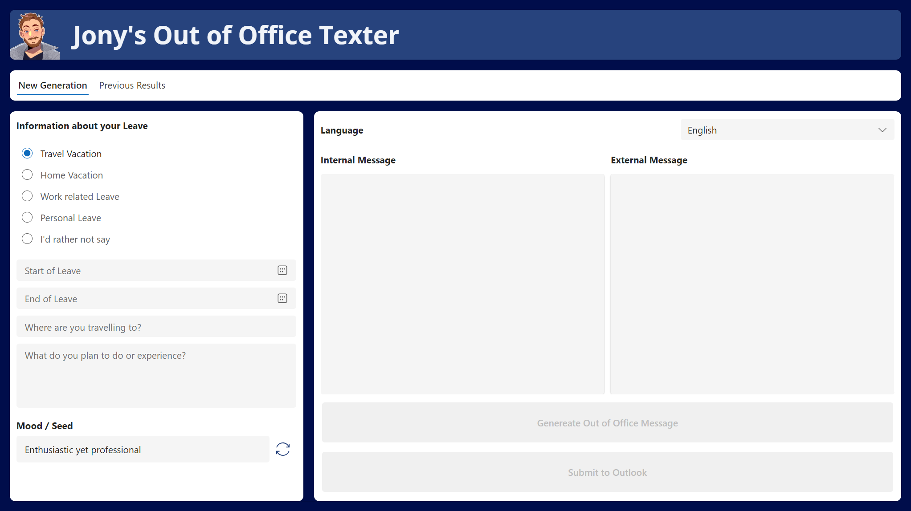

# Jony's Out of Office Texter

## Description

Jony's Out of Office Texter is a stand-alone Canvas App that utilizes the power of Azure Open AI's GPT model, currently available only in US regions, to generate personalized and creative out of office messages for Outlook. Say goodbye to the same old and boring out of office responses, and let Jony's Out of Office Texter craft witty, professional, and engaging messages on your behalf.

  

## Authors

Solution|Author(s)
--------|---------
Jonys Out of Office Texter | [Jonas Portmann](https://github.com/mangescom) ([@jonas-portmann](https://www.linkedin.com/in/jonas-portmann/) )

## Version history

Version|Date|Comments
-------|----|--------
1.0|September 28, 2023|Initial release

## Features

* No Database Required: Jony's Out of Office Texter is designed to be used without the need for a database. All data is saved securely in the device's cache using the SaveData() command.
* AI Builder GPT Model: The app utilizes the AI Builder GPT model to create intelligent and context-aware out of office messages.
* Time-Sensitive: The app can automatically set your out of office message for a specific time frame, ensuring it's active when you need it.
* Customization: You can fine-tune the generated message by using the seed attribute or add a personal touch before setting it as your out of office response.

## Getting Started
To get started with Jony's Out of Office Texter, follow these steps:

1.	Download the app ZIP file from [Jony's Out of Office Texter]([https://github.com/jony-oof-texter/releases](https://github.com/Mangescom/powerplatform-samples/tree/mangescom---Jonys-out-of-Office-Texter/samples/Jonys%20Out-of-Office%20Texter/solution).
2.	Import the app into your environment.
3.	If prompted, add a connection for Outlook to enable seamless integration.
4.	Connect your Outlook account to start generating creative out of office messages.

## Data Sources
 
None

## Disclaimer

**THIS CODE IS PROVIDED *AS IS* WITHOUT WARRANTY OF ANY KIND, EITHER EXPRESS OR IMPLIED, INCLUDING ANY IMPLIED WARRANTIES OF FITNESS FOR A PARTICULAR PURPOSE, MERCHANTABILITY, OR NON-INFRINGEMENT.**
Please note that this disclaimer applies to the solution as a whole, and any use of the app is at your own discretion and risk.

## Support

You can create a new issue, question or suggestion, but no support is guaranteed.
